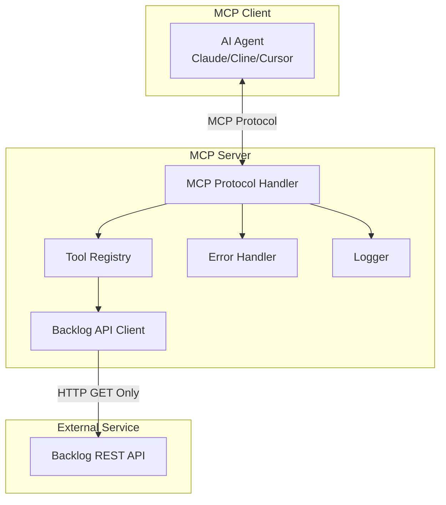

# 設計文書

## 概要

Backlog読み取り専用MCPサーバーは、TypeScriptとNode.jsを使用して実装されるModel Context Protocolサーバーです。このサーバーは、BacklogのREST APIを利用してプロジェクト、課題、ユーザー、Wikiなどの情報を読み取り専用で提供します。セキュリティを重視し、データの変更や作成は一切行いません。

## アーキテクチャ

### 全体構成



### レイヤー構成

1. **MCPプロトコル層**: MCPクライアントとの通信を処理
2. **ツール層**: 各種Backlogツールの実装
3. **APIクライアント層**: Backlog REST APIとの通信
4. **ユーティリティ層**: エラーハンドリング、ログ、設定管理

## コンポーネントと インターフェース

### MCPサーバーコンポーネント

#### 1. MCPサーバー（McpServer）
- **責任**: MCPプロトコルの処理、ツールの登録・管理
- **依存関係**: @modelcontextprotocol/sdk
- **インターフェース**: 
  - `listTools()`: 利用可能なツール一覧を返す
  - `callTool(name, args)`: 指定されたツールを実行

#### 2. BacklogAPIクライアント（BacklogApiClient）
- **責任**: Backlog REST APIとの通信、APIキーの安全な管理
- **設定**: 環境変数（ワークスペース`.backlog-mcp.env`優先）からAPIキー・ドメイン・オプション設定を読み込み
- **セキュリティ機能**:
  - APIキーのマスキング（ログ出力時）
  - APIキーの有効性検証
- **インターフェース**:
  - `get(endpoint, params?)`: GETリクエストの実行
  - `handleRateLimit()`: レート制限の処理
  - `validateApiKey()`: APIキーの有効性チェック
  - `loadConfig()`: 環境変数と.backlog-mcp.envファイルからの設定読み込み

#### 3. ツールレジストリ（ToolRegistry）
- **責任**: 各種Backlogツールの登録と管理
- **ツールカテゴリ**:
  - プロジェクト関連ツール
  - 課題関連ツール
  - ユーザー関連ツール
  - Wiki関連ツール
  - マスタデータ関連ツール

### ツール実装

#### プロジェクト関連ツール

```typescript
interface ProjectTool {
  name: string;
  description: string;
  inputSchema: JSONSchema;
  handler: (args: any) => Promise<any>;
}
```

**実装ツール**:
- `get_projects`: プロジェクト一覧取得
- `get_project`: プロジェクト詳細取得
- `get_project_users`: プロジェクトメンバー取得

#### 課題関連ツール

**実装ツール**:
- `get_issues`: 課題一覧取得（検索条件付き）
- `get_issue`: 課題詳細取得
- `get_issue_comments`: 課題コメント取得
- `get_issue_attachments`: 課題添付ファイル取得

#### その他のツール

**ユーザー関連**: `get_users`, `get_user`, `get_myself`
**Wiki関連**: `get_wikis`, `get_wiki`
**マスタデータ関連**: `get_priorities`, `get_statuses`, `get_resolutions`, `get_categories`

## データモデル

### 設定モデル

```typescript
interface BacklogConfig {
  domain: string;           // example.backlog.com
  apiKey: string;           // APIキー
  defaultProject?: string;  // デフォルトプロジェクトキー
  maxRetries: number;       // リトライ回数
  timeout: number;          // タイムアウト（ms）
}
```

### APIキー管理

#### 環境変数による設定
APIキーとドメインは環境変数で管理し、ワークスペース単位での設定も可能です。

**設定の優先順位**：
1. **ワークスペース設定ファイル** (最優先)
   - プロジェクトルートの`.backlog-mcp.env`ファイル
   - ワークスペース固有の設定
2. **システム環境変数**
   - グローバルな設定

**必須環境変数**:
- `BACKLOG_API_KEY`: BacklogのAPIキー
- `BACKLOG_DOMAIN`: Backlogドメイン（例: your-company.backlog.com）

**オプション環境変数**:
- `BACKLOG_DEFAULT_PROJECT`: デフォルトプロジェクトキー（例: MYPROJ）
- `BACKLOG_MAX_RETRIES`: リトライ回数（デフォルト: 3）
- `BACKLOG_TIMEOUT`: タイムアウト（ms、デフォルト: 30000）

#### ワークスペース単位の設定
プロジェクトルートに`.backlog-mcp.env`ファイルを配置することで、ワークスペース固有の設定が可能：

```bash
# プロジェクトA/.backlog-mcp.env
BACKLOG_DOMAIN="company-a.backlog.com"
BACKLOG_API_KEY="project-a-api-key"
BACKLOG_DEFAULT_PROJECT="PROJA"

# プロジェクトB/.backlog-mcp.env  
BACKLOG_DOMAIN="company-b.backlog.com"
BACKLOG_API_KEY="project-b-api-key"
BACKLOG_DEFAULT_PROJECT="PROJB"
```

#### デフォルトプロジェクト機能
多くの場合、特定のプロジェクトに集中して作業するため、デフォルトプロジェクトを設定できます：

- `BACKLOG_DEFAULT_PROJECT`が設定されている場合、プロジェクトIDを省略可能
- 課題取得時に自動的にデフォルトプロジェクトを使用
- 明示的にプロジェクトIDを指定すれば他のプロジェクトにもアクセス可能

#### セキュリティ対策
```typescript
interface SecurityConfig {
  // APIキーの有効性チェック
  validateApiKey: boolean;
  // ログにAPIキーを出力しない
  maskSensitiveData: boolean;
}
```

#### 環境変数設定例

**システム全体の設定**:
```bash
export BACKLOG_DOMAIN="your-company.backlog.com"
export BACKLOG_API_KEY="your-api-key-here"
```

**ワークスペース固有の設定** (`.backlog-mcp.env`ファイル):
```bash
# プロジェクトA/.backlog-mcp.env
BACKLOG_DOMAIN="company-a.backlog.com"
BACKLOG_API_KEY="project-a-api-key"
BACKLOG_DEFAULT_PROJECT="PROJA"
BACKLOG_MAX_RETRIES="3"
BACKLOG_TIMEOUT="30000"
```

#### MCPクライアント設定例
```json
{
  "mcpServers": {
    "backlog-readonly": {
      "command": "node",
      "args": ["dist/index.js"],
      "cwd": "${workspaceFolder}",
      "env": {
        "NODE_ENV": "production"
      }
    }
  }
}
```

**注意**: MCPクライアント設定では`cwd`を`${workspaceFolder}`に設定することで、ワークスペースの`.backlog-mcp.env`ファイルが自動的に読み込まれます。

#### 使用例
```typescript
// デフォルトプロジェクトの課題を取得
await callTool("get_issues", {});

// 特定プロジェクトの課題を取得
await callTool("get_issues", { projectId: "OTHERPROJ" });

// デフォルトプロジェクトの課題詳細を取得
await callTool("get_issue", { issueKey: "MYPROJ-123" });
```

### APIレスポンスモデル

```typescript
interface BacklogProject {
  id: number;
  projectKey: string;
  name: string;
  chartEnabled: boolean;
  subtaskingEnabled: boolean;
  projectLeaderCanEditProjectLeader: boolean;
  useWikiTreeView: boolean;
  textFormattingRule: string;
  archived: boolean;
  displayOrder: number;
  useDevAttributes: boolean;
}

interface BacklogIssue {
  id: number;
  projectId: number;
  issueKey: string;
  keyId: number;
  issueType: IssueType;
  summary: string;
  description: string;
  resolution: Resolution | null;
  priority: Priority;
  status: Status;
  assignee: User | null;
  category: Category[];
  versions: Version[];
  milestone: Milestone[];
  startDate: string | null;
  dueDate: string | null;
  estimatedHours: number | null;
  actualHours: number | null;
  parentIssueId: number | null;
  createdUser: User;
  created: string;
  updatedUser: User;
  updated: string;
  customFields: CustomField[];
  attachments: Attachment[];
  sharedFiles: SharedFile[];
  stars: Star[];
}
```

### エラーモデル

```typescript
interface BacklogError {
  code: string;
  message: string;
  details?: any;
}

interface MCPError {
  code: number;
  message: string;
  data?: any;
}
```